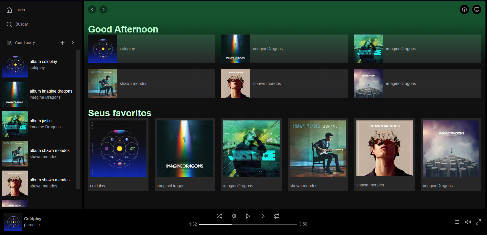

# Clone-Spotify
Primeiro projeto utilizando NextJs juntamente com a biblioteca REACT.

nesse projeto fiz um clone do aplicativo spotify fazendo uso de componentes do react para fazer cada sessão do site.

utilizei também conceitos como props para fazer um mapeamento de uma variavel CONST onde adicionei informações de albums de alguns artistas e deixando dinamico a interação de imagens dos albums e descrições das musicas.

Pretendo adicionar mais funcionabilidades para esse projetos,mas aprendi muitas coisas  novas e conceitos que não tinha conhecimento sobre como funciona o REACT.

a estilização do site foi utilizado o TAILWIND.

